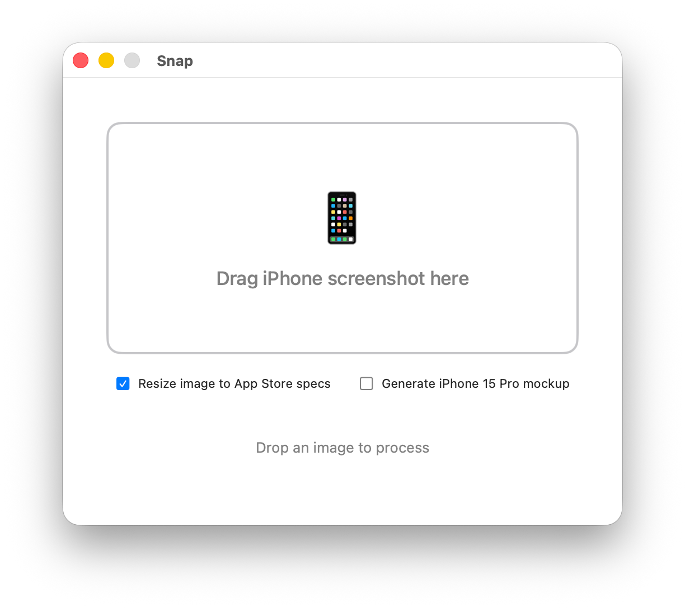

# Snap

A macOS utility for processing iPhone screenshots. Drag and drop an image to:

- **Resize for App Store** – Scales images to 1260×2736 pixels for App Store submissions
- **Generate iPhone Mockup** – Composites your screenshot into an iPhone 15 Pro frame

## Requirements

- macOS 15.5+
- Xcode 16+

## Usage

1. Open in Xcode and run the Snap scheme
2. Drag an iPhone screenshot onto the drop zone
3. Select your desired processing mode
4. The processed image is saved alongside the original and revealed in Finder

## License

MIT
